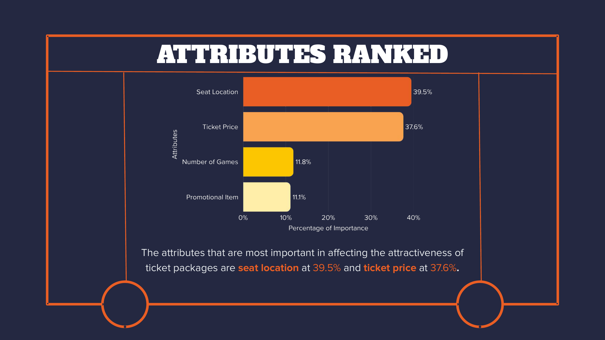
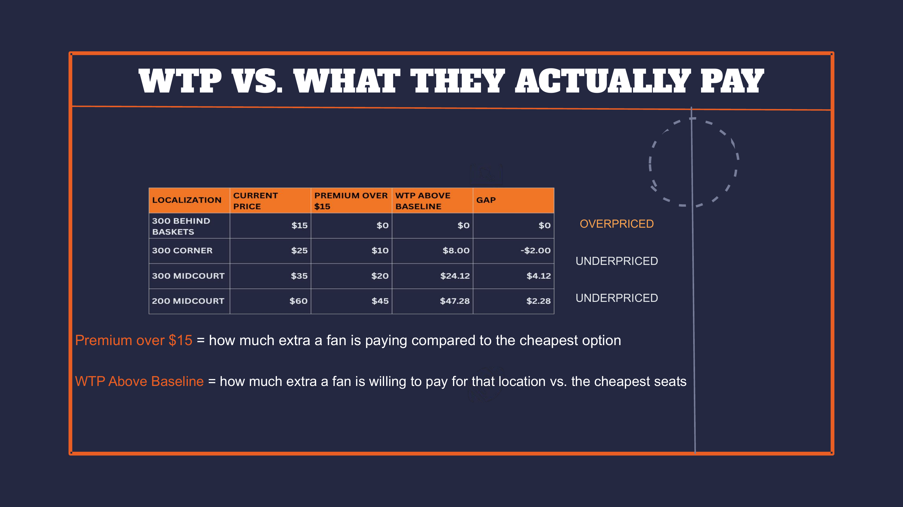
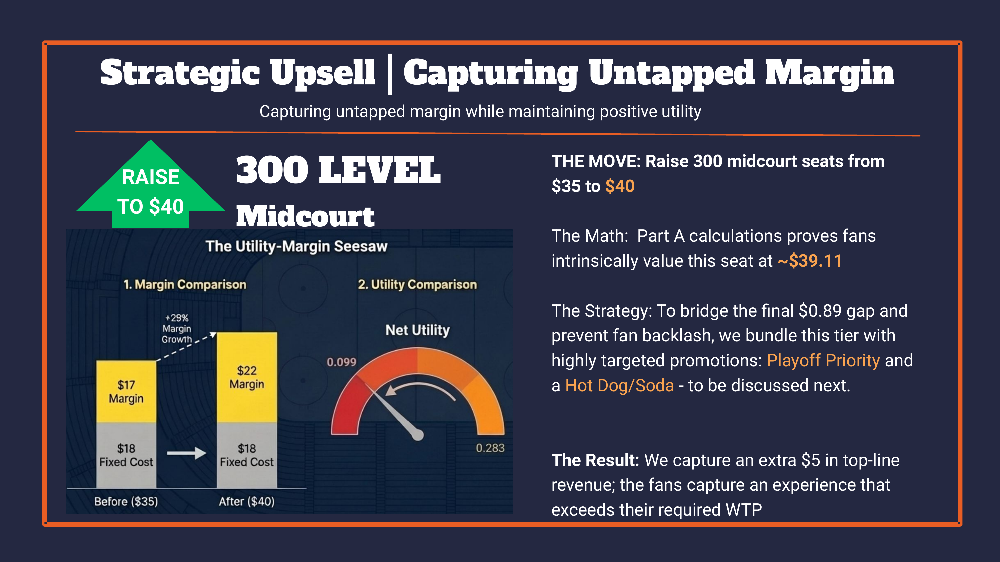

# Portland Trail Blazers — Conjoint Pricing & Ticket Package Strategy

Conjoint analysis project estimating attribute importance and willingness-to-pay (WTP) for ticket package features (seat location, price, games, promotions) and translating results into pricing actions under real operational constraints.

## Highlights
- Calculated attribute importance (seat location and ticket price drove most preference)
- Converted utilities into WTP guidance and compared WTP vs current pricing
- Produced actionable recommendations: “volume play” price decrease where value was negative, and strategic upsell where value exceeded price
Identified packages where WTP < current price (value deficit) and recommended a “volume play” price decrease; identified packages where WTP > current price and recommended strategic upsell

## Visuals

### Attribute Importance

### WTP vs Current Price

### Strategic Recommendation Example

## Repo Structure
- `slides/` — submitted deck (PDF)
- `analysis/` — pricing/WTP workbook (Excel)
- `assets/` — visuals embedded above

> Case handouts and raw datasets are excluded due to licensing restrictions.

Note: Case handouts, raw survey data, and cost tables are excluded due to licensing restrictions. This repo contains only original analysis outputs and visuals.
